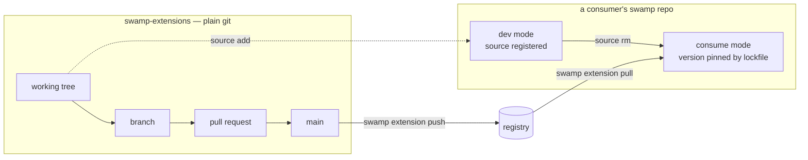

# swamp-extensions

Source of truth for the **`@twonines`** collective's [Swamp](https://swamp-club.com)
extensions. One subdirectory per extension — `extensions/models/<name>/` for a model
extension, `workflows/<name>/` for a workflow — each holding its own manifest, TypeScript,
tests and README. For what an extension does and how to install it, read that extension's
README.

The registry serves the published releases; this repository holds the source they were
built from, and is where changes to them are reviewed.

**Plain git — not a Swamp repository.** No `swamp repo init`, no `.swamp.yaml`. Publishing
is a swamp-repo operation, so it runs from a Swamp-initialized repository elsewhere and
points back at a manifest here.

Layout, conventions and traps for working in the tree: [`AGENTS.md`](AGENTS.md).

## Recommended workflow



Every extension change reaches `main` by pull request — that is the review gate.

**Push the source first, publish second.** `repository-verified` — 2 of the 14 quality
points — is confirmed server-side against the `repository:` URL in the manifest at publish
time. Publishing before the change is on `main` declares a source location that does not
yet contain the source.

```bash
EXT=$PWD/workflows/my-extension   # the extension you are working on — absolute path
REPO=~/path/to/a/swamp-repo       # the swamp repo you test and publish from

git switch -c short-description-of-change   # one extension per branch and per pull request

# Enter dev mode: $REPO loads this extension from the working tree, not the registry.
swamp extension source add $EXT --repo-dir $REPO

deno test --allow-env $EXT   # its own tests; flags vary, --allow-env is the minimum
deno check $EXT              # typecheck the TypeScript it ships

# Ask the registry for the next CalVer version, then lint and score the manifest.
swamp extension version --manifest $EXT/manifest.yaml --json
swamp extension fmt     $EXT/manifest.yaml --check --repo-dir $REPO --json
swamp extension quality $EXT/manifest.yaml --repo-dir $REPO --json

# Open the pull request and get it merged. Then, and only then, publish.
swamp extension push $EXT/manifest.yaml --dry-run --repo-dir $REPO --json   # preview
swamp extension push $EXT/manifest.yaml --yes     --repo-dir $REPO --json   # for real

# Back to consume mode: stop shadowing, adopt the release you just published.
swamp extension source rm $EXT --repo-dir $REPO
swamp extension pull @twonines/my-extension
```

`$EXT` is absolute because with `--repo-dir` a relative manifest path resolves inside the
swamp repo, not here. `--repo-dir` itself must point at a swamp repository; swamp refuses
outright otherwise (`Not a swamp repository: …`).

Keep the manifest version and the model source in step. **Aim for 14/14 on `quality`** —
12 are earnable locally and all 12 should be earned; the registry awards the last 2 on
publish, from the source already on `main`.

Consumers other than you adopt a release on their own schedule — a published version stays
pinned by their lockfile until they ask for the new one.

## Why dev mode needs `source rm`

Load order is local `extensions/` → registered sources → pulled extensions, so **a
registered source shadows a pulled extension of the same type**: the repo silently runs
uncommitted code while `swamp extension list` still reports the published version. That is
why `source rm` closes the loop above — **steady state is zero registered sources.**
`.swamp-sources.yaml` records them; it is developer-specific and git-ignored.

## License

MIT — see [`LICENSE`](LICENSE). Extensions ship their own license file alongside their
manifest.
